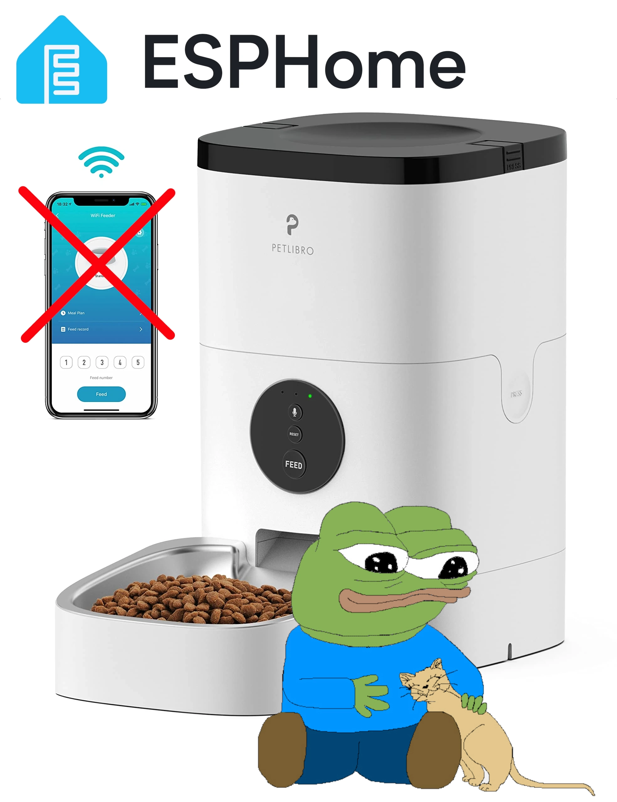

# petlibro-plaf101-jailbreak

[](https://github.com/majabojarska/petlibro-plaf101-jailbreak/actions/workflows/status.yaml)

Guide and sources for jailbreaking the Petlibro PLAF101 pet feeder from the Tuya cloud.



## Setup development environment

```sh
# Optional: create and activate virtualenv

pip install -r requirements.txt
```
