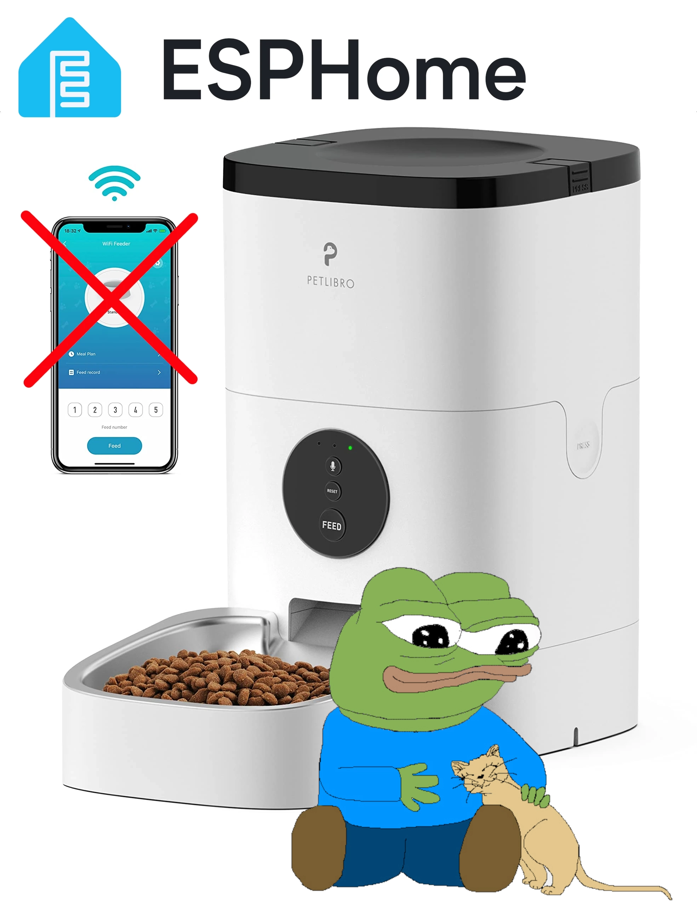

# petlibro-plaf101-jailbreak

[](https://github.com/majabojarska/petlibro-plaf101-jailbreak/actions/workflows/status.yaml)

Guide and sources for jailbreaking the Petlibro PLAF101 pet feeder from the Tuya cloud.

> [!NOTE]
> This is a work in progress.



## Setup development environment

```sh
# Optional: create and activate virtualenv

pip install -r requirements.txt
```

## To-do

- Serve N scoops in one go
  - Must track the number of scoops left to feed.
  - Must clip the requested number of scoops at some max, like 5.
  - Hitting the endstop decrements the scoops count left to feed.
- Feed functionality is iffy after a reboot. Figure this out. Something about the post-reboot init.
- LEDs for communicating error states.
- Export error states via binary sensors.
